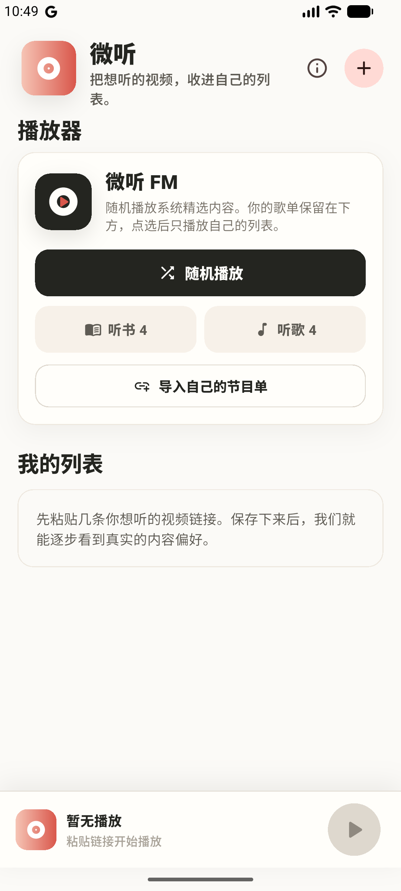
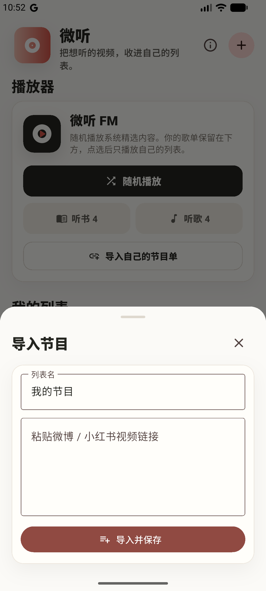
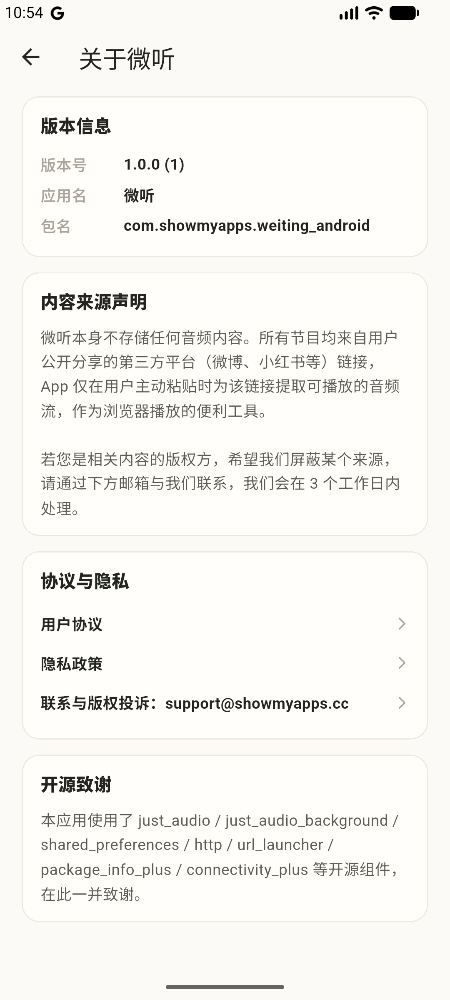

# 微听 Weiting

把想听的视频，收进自己的听单。

「微听」是一个轻量的 Flutter 音频收听工具：粘贴第三方公开视频分享链接，提取其中的音频，像听播客一样收听——支持**后台播放、锁屏/通知栏控制、耳机线控、进度记忆**。

> ⚠️ 本仓库只包含 **Android 客户端**。负责链接解析与媒体代理的后端服务（`/api/resolve`、`/api/stream`）不在此仓库内，需自行实现或对接。

## 📱 界面预览

| 首页 · 微听 FM | 导入节目 | 关于页 |
| :---: | :---: | :---: |
|  |  |  |

## ✨ 功能

- **链接导入**：粘贴一段分享文本或多条链接，自动识别、批量并发导入（可取消）。
- **听单管理**：分类整理成多个听单，本地保存（SharedPreferences）。
- **后台播放**：基于 `just_audio` + `just_audio_background`，锁屏 / 息屏 / 切后台持续播放。
- **锁屏 & 通知栏控制**：媒体会话通知，支持耳机线控。
- **系统 FM**：一键随机播放示例池，播完自动续播下一首。
- **健壮性**：API 自动重试 + 健康检查横幅、URL 过期/断网自动恢复（带重试上限防风暴）。

## 🏗️ 技术栈

- Flutter 3.38 / Dart 3.10
- [`just_audio`](https://pub.dev/packages/just_audio) · [`just_audio_background`](https://pub.dev/packages/just_audio_background) · [`audio_session`](https://pub.dev/packages/audio_session)
- [`http`](https://pub.dev/packages/http) · [`connectivity_plus`](https://pub.dev/packages/connectivity_plus) · [`shared_preferences`](https://pub.dev/packages/shared_preferences)
- [`url_launcher`](https://pub.dev/packages/url_launcher) · [`package_info_plus`](https://pub.dev/packages/package_info_plus)

## 📁 项目结构

```
lib/
  main.dart          # 入口 + 首页/播放器/Mini Player 等全部 UI
  api.dart           # API 客户端：重试、超时、并发、健康检查、媒体地址拼装
  models.dart        # 数据模型 + URL 提取/分类推断等纯函数（含单测）
  recommended.dart   # 系统 FM 示例池（演示用，可替换）
  about_page.dart    # 关于页：版本、内容声明、隐私/协议入口
android/             # 自适应图标、启动屏、签名/混淆配置
branding/            # 图标与启动屏的 Pillow 生成脚本及源图
test/                # 单元测试 + Widget 测试
```

## 🚀 本地运行

```bash
flutter pub get
flutter run
```

后端地址在 `lib/api.dart` 顶部 `apiBase` 常量，按需修改为你自己的服务。

## 📦 构建发布

```bash
flutter build apk --release        # APK
flutter build appbundle --release  # Play 上传用 AAB
```

正式签名：复制 `android/key.properties.example` 为 `android/key.properties` 并填入你的 keystore 信息（该文件已被 `.gitignore` 忽略，不会入库）。未配置时 release 会回退 debug 签名，仅供本地验证。

品牌资源重新生成：

```bash
python3 branding/generate.py          # 图标 + 启动屏源图
python3 branding/generate_store.py    # 商店图形
dart run flutter_launcher_icons       # 生成各密度图标
dart run flutter_native_splash:create # 生成启动屏
```

## ✅ 质量

```bash
flutter analyze   # 0 issue
flutter test      # 单元 + Widget 测试
```

## ⚖️ 免责声明 / Disclaimer

- 本应用是一个**通用音频播放工具**，**不托管、不存储、不分发**任何音视频内容。
- 所有可播放内容均来自**用户主动提供或点击的第三方公开分享链接**，等同于用户自己可在浏览器打开的公开页面。
- 与微博、小红书、YouTube 或任何第三方平台**无任何关联、未获其授权或背书**。
- 使用者应**仅收听自己有合法权利访问的内容**，并对其使用行为负责。
- 仓库内 `recommended.dart` 的示例链接仅用于演示，**建议自行替换为你有权分发的内容**。
- 本软件按「现状」提供，不附带任何明示或默示担保（见 [LICENSE](LICENSE)）。

## 📄 License

[MIT](LICENSE) © 2026 laosji
